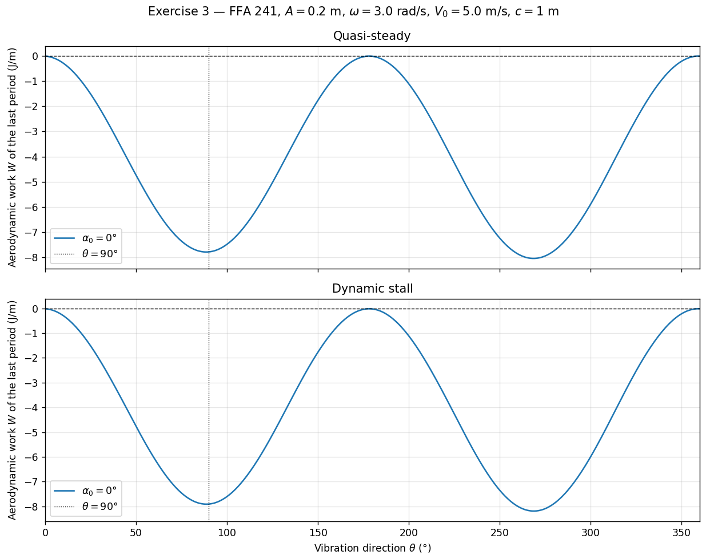
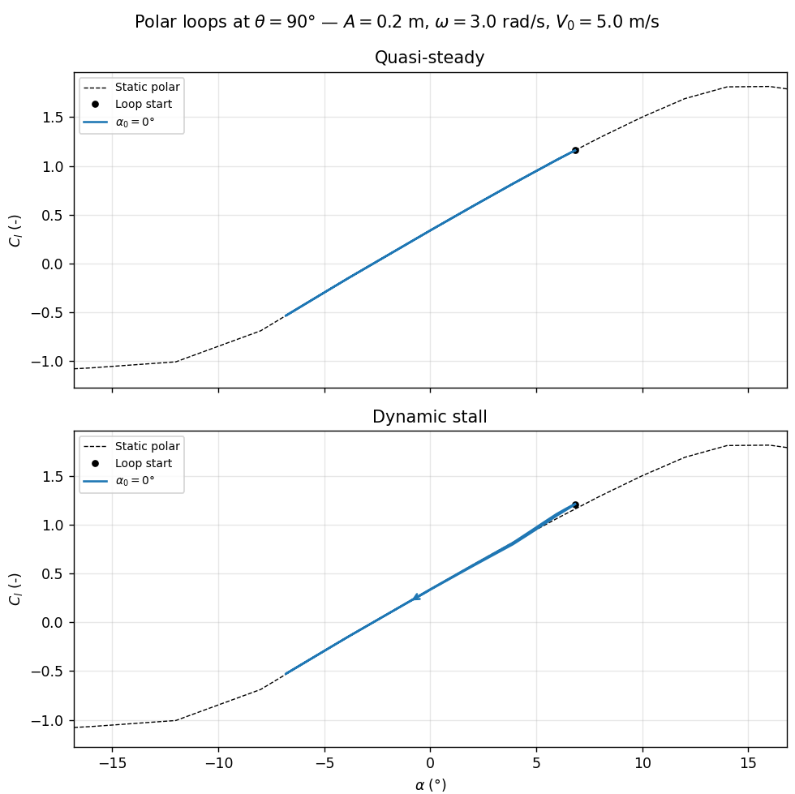
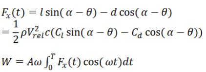
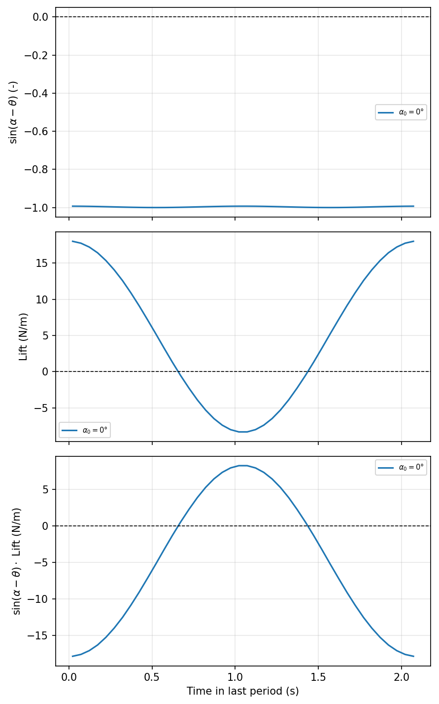
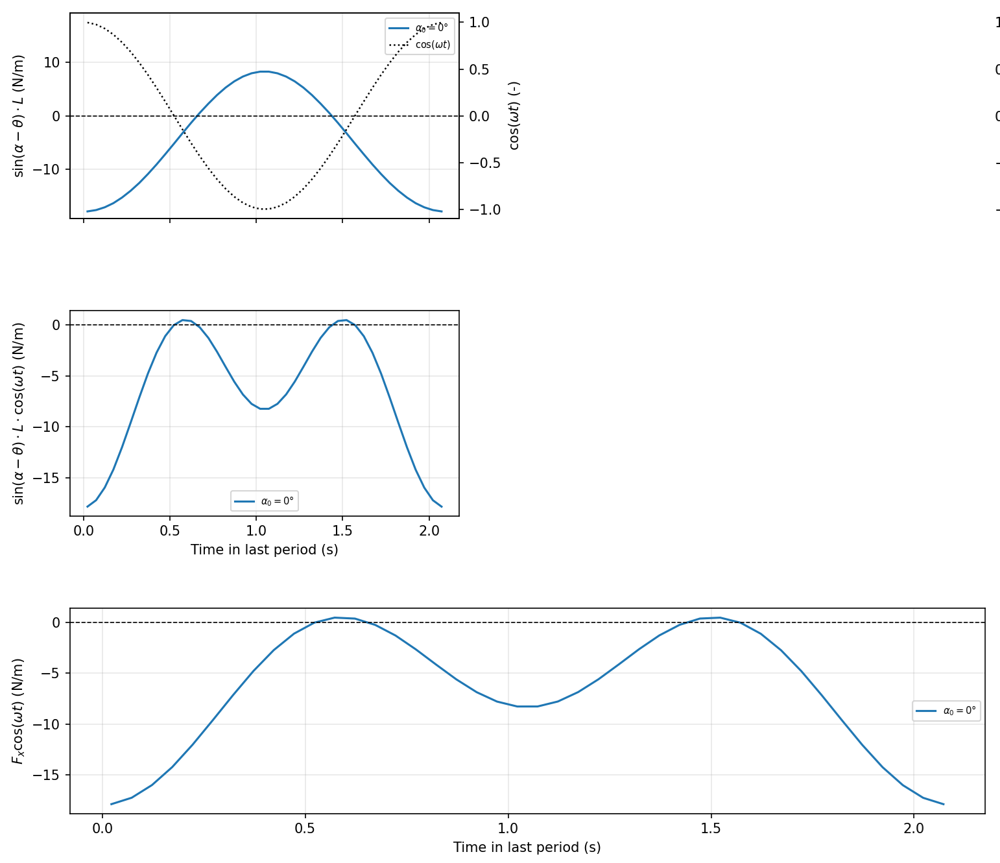
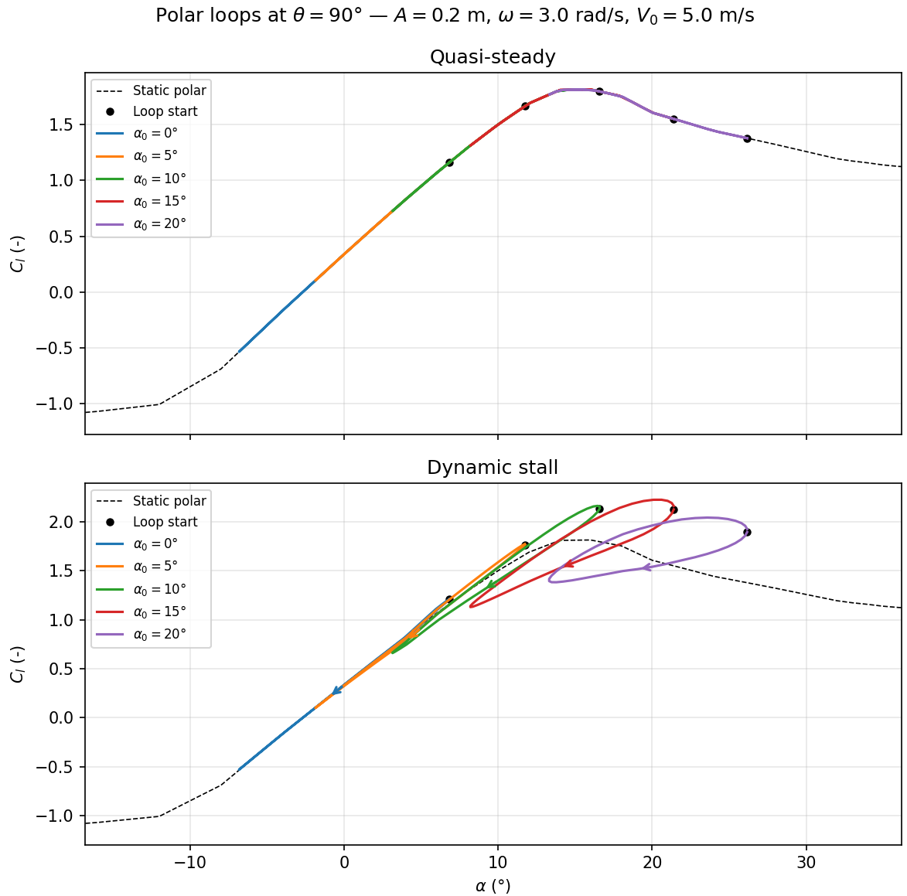

# Aerodynamic Damping of an Oscillating Airfoil

**DTU 46310 — Wind Turbine Aeroelasticity, Exercise 3**

---

## Overview

This script investigates whether the aerodynamic forces on a vibrating airfoil add energy to or remove energy from the oscillation. This question is at the heart of aeroelastic stability: if the aerodynamics consistently pump energy *into* a structural mode, that mode will grow.

The script computes the **aerodynamic work** done per oscillation cycle as a function of the vibration direction angle θ and the mean angle of attack α₀, using two aerodynamic models:

- **Quasi-steady (QS):** lift and drag are read directly from the static polar at each instant.
- **Dynamic stall (DS):** a first-order lag (Øye model) is applied to the separation state, introducing hysteresis in the $C_l$ response.

Four PDF figures are produced:

| File | Content |
|---|---|
| `exercise_3_work.pdf` | Aerodynamic work W vs. vibration direction θ |
| `exercise_3_polar_loops.pdf` | $C_l$ polar loops (QS and DS) at one chosen θ |
| `exercise_3_components.pdf` | Time series of the individual force components over the last period |
| `exercise_3_work_integrand.pdf` | Decomposition of the work integrand into lift and drag contributions |

---

## Prerequisites

```python
numpy
pandas
matplotlib
```

All data is read from `rel_t_241.csv` (FFA-W3-241 airfoil polar, relative thickness 24.1%).

---

## Quick Start

1. Create and activate a virtual environment.
2. `pip install -r requirements.txt`
3. `python exercise_3.py`
4. The four PDF figures are saved in the working directory and displayed on screen.

---

## Parameters

All tunable parameters are collected at the top of the script:

```python
A       = 0.2      # Vibration amplitude (m)
omega   = 3.0      # Vibration angular frequency (rad/s)
V0      = 5.0      # Mean inflow speed (m/s)
c       = 1        # Chord length (m)
rho     = 1.225    # Air density (kg/m³)
N_cycles = 5       # Number of oscillation cycles simulated
                   # (the last cycle only is used for the work integral)

alpha0_list = np.array([0, 15])   # Mean angles of attack to sweep (degrees)
theta_list  = np.arange(0, 361)   # Vibration directions to sweep (degrees)
theta_plot  = 90                  # Vibration direction used for the polar loop plots

figs34_dynamic_stall = False  # True  → figs 3 & 4 show dynamic stall results
                              # False → figs 3 & 4 show quasi-steady results
```
---

## Example  

This example corresponds to the introductory example from the lecture. The airfoil moves mostly flapwise (here up and down) and wind is coming in from the left with 0° (steady) angle of attack. The settings are:

```python
A       = 0.2    
omega   = 3.0   
V0      = 5.0    
c       = 1        
rho     = 1.225    
N_cycles = 5    

alpha0_list = np.array([0]) 
theta_list  = np.arange(0, 361) 
theta_plot  = 90 

figs34_dynamic_stall = False  
```
---

Next, we'll investigate the four plots created by `exercise_3.py`. Figure 1 shows the total aerodynamic work of the last period for different vibration directions. The vertical dashed line indicates the vibration direction that the next plots focus on. In this case, we expect strong positive aerodynamic damping for the $\theta=90°$ case.


Figure 2 shows the $C_l$ loops of the last period for the quasi-steady and dynamic stall case. The black dot shows the start of the loop; the arrow (in the dynamic stall case) shows the direction of the loop. Since the airfoil is almost completely operating in the attached region, there is only a minor difference between the quasi-steady and dynamic stall case. Already judging by the loops we see here, we expect positive aerodynamic damping.


Figures 3 and 4 give us insights into the power that the lift and drag pump into or take out of the structural oscillation. From the lecture, we know that the work done of the aerodynamic forces during one period can be calculated as

Figure 3 focuses on visualising $F_x$ over one period and Figure 4 focuses on the product in the integral. For now, we will only focus on the lift contribution; the reasoning for the drag contribution is very similar.

Lets look at Figure 3 that shows different quantities over one period. The first row shows the $\sin(\alpha-\theta)$ term that acts as projecting the lift onto the oscillation axis. In this case, it is $\approx-1$. The second row shows the lift. The last row shows the product of the first two: how much of the lift is acting in the direction of the osciallation axis $x$. In other terms: the lift's contribution to $F_x$.


Knowing the lift's contribution to $F_x$, we now investigate the lift's contribution to the aerodynamic power with Figure 4. Again, the plots show distrubtions over one period. In the top row, we see the bottom plot of Figure 3 again with an overlay of $\cos(\omega t)$ on the right y-axis. $\cos(\omega t)$ defines the direction and speed of the oscillation (when multiplied with $A\omega$). The product of the lift's contribution and this $\cos$ term thus dictates whether the lift is adding or extracting energy from the structure; this is shown in the second row. We were expecting strong positive damping and that is what we mostly see. However, how come there are two regions where the aerodynamics actually add energy to the system (negative damping)? At last, the plot in the third row shows the sum of the lift's and drag's power contribution (we excluded the drag in this example).


## Play around

You can set multiple $\alpha_0$ values at once and compare the results. For example, here are some more $C_l$ loops.


